# QRede

## English
App to help to share your wifi configuration whitout sharing your password

### Features:
- Create a QR Code with your wifi configuration
- Scan a QR Code with wifi configuration
- Share any wifi QR Code 
- Save and delete any wifi QR Code
- Connect to a saved wifi QR Code 

### Limitations:
Due to Google discontinuation of wifimanager API in later android version. This application only works in android versions from 5 to 8.1

### Supported Languages:
- English (en-US)
- Portuguese (pt-BR)

## Português
Aplicativo para compartilhar sua rede wifi, sem compartilhar sua senha

### Funções:
- Criar um código QR com as configurações do seu wifi
- Escanear um código QR que possua configurações de wifi
- Compartilhar qualquer código QR de wifi
- Salvar e excluir qualquer código QR de wifi
- Conectar a um código QR salvo

### Limitações:
Devido a google descontinuar o uso da API do wifimanager nas ultimas versões do Android. Esse aplicativo só funciona nas versões do Android do 5 ao 8.1

### Linguagens Suportadas

- Inglês (en-US)
- Português (pt-BR)

## APP

### Light Theme:
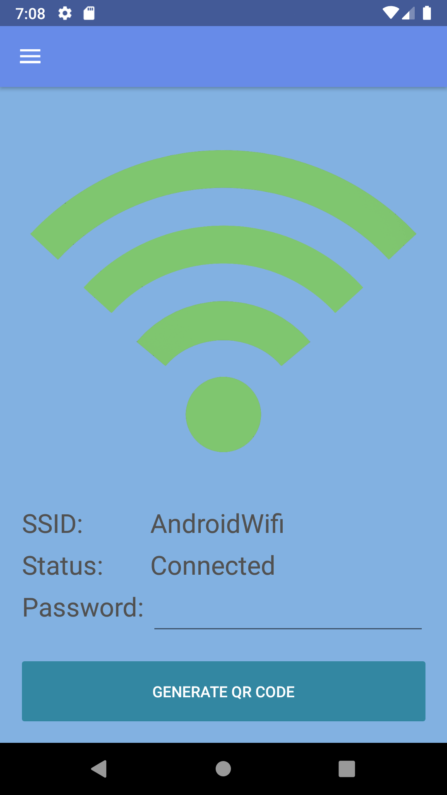 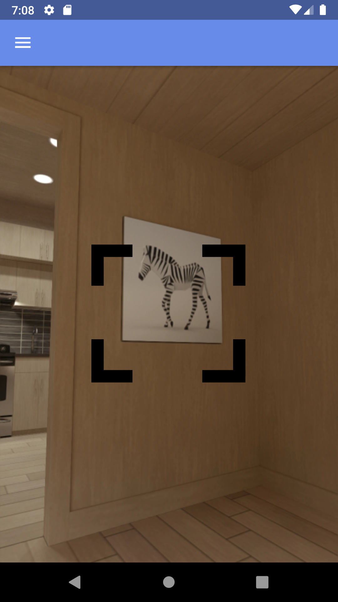 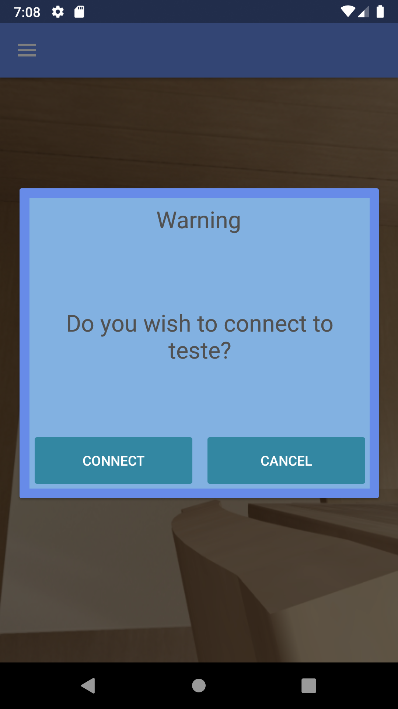 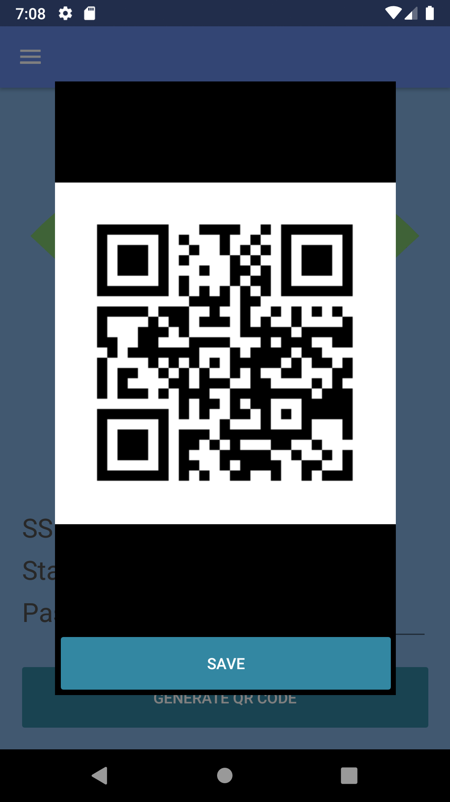 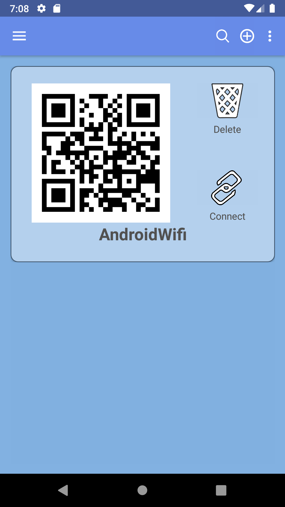 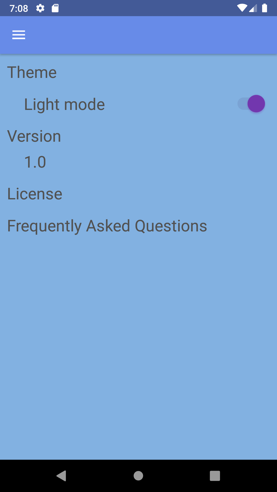

### Dark Theme:
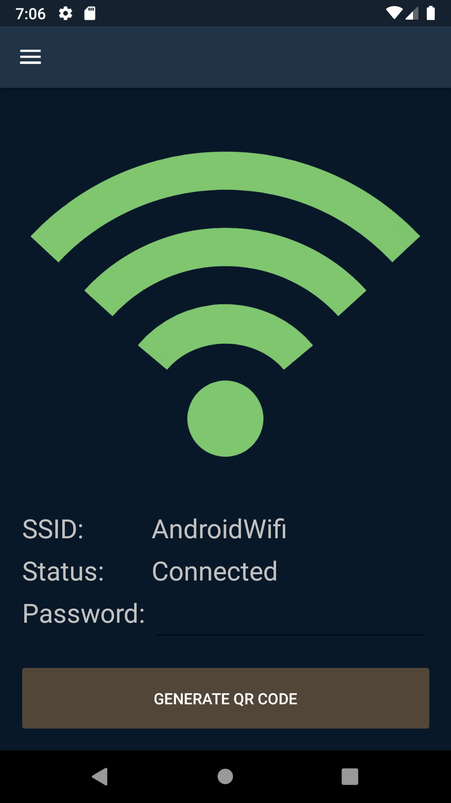 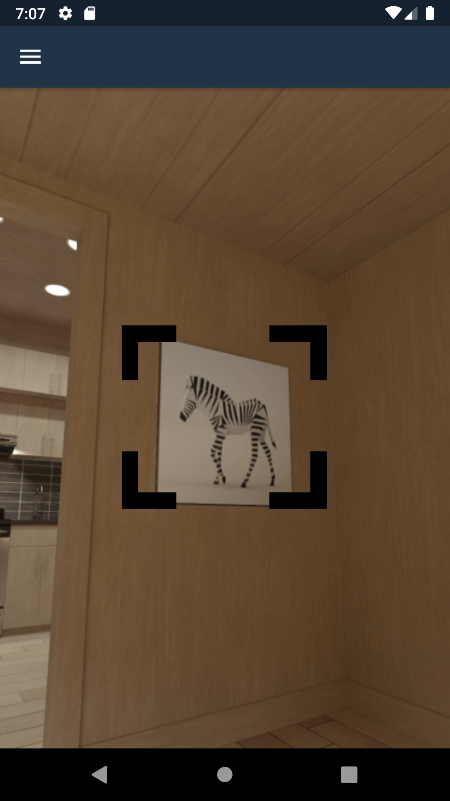 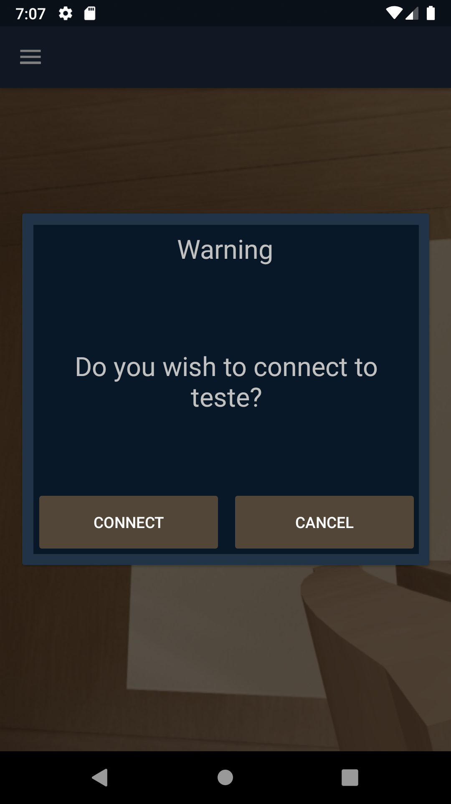 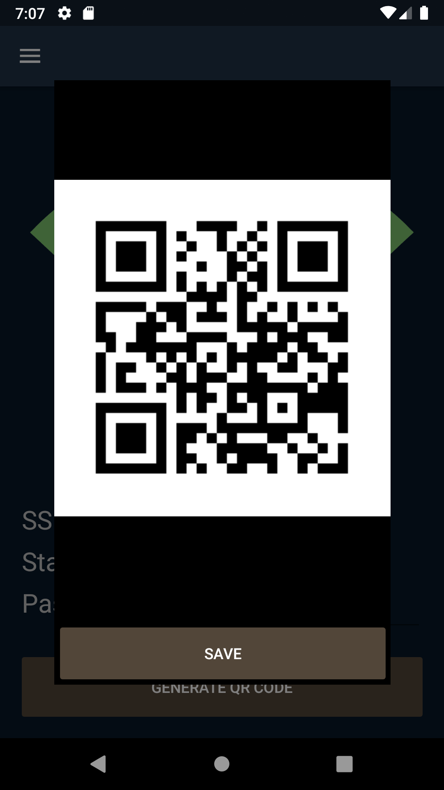 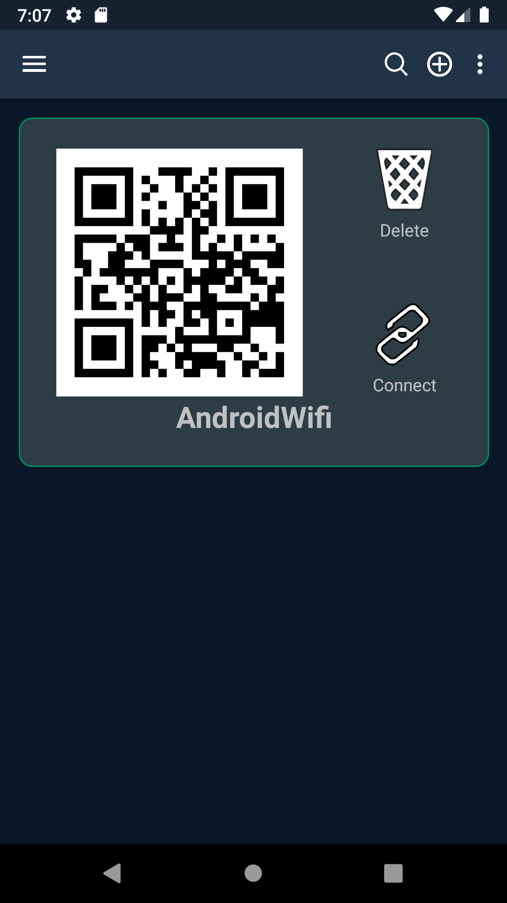 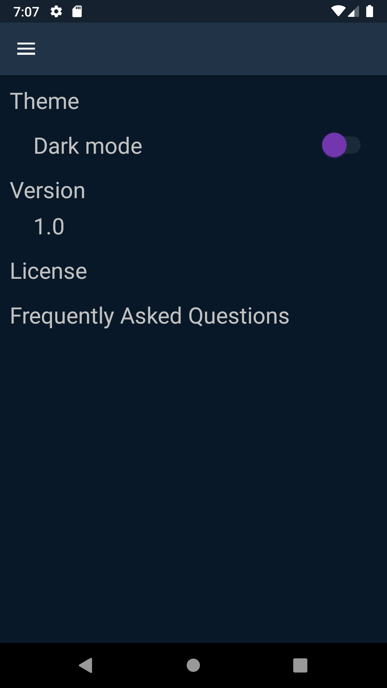
